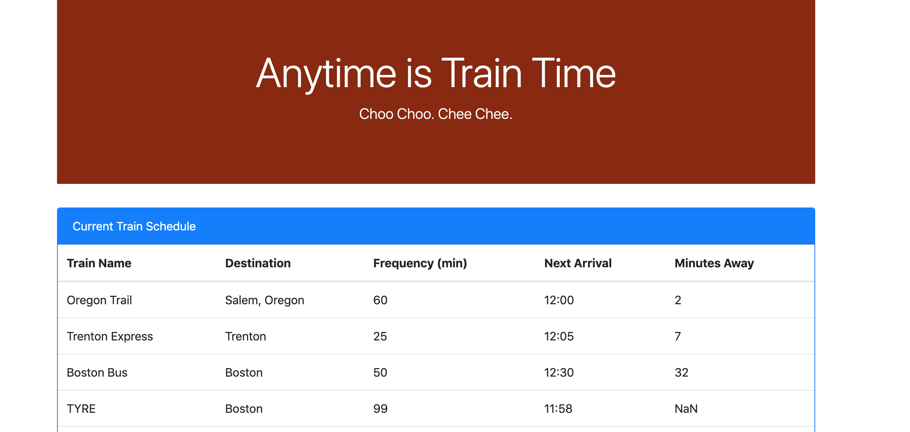
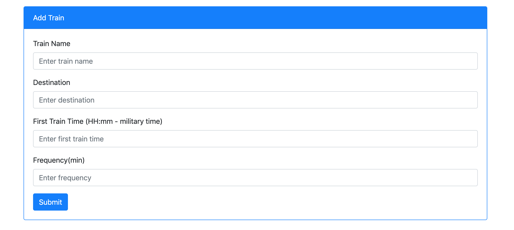

# Train-Scheduler

### Role & Contact Information
Full-stack Web Developer 

General inquiries at ddzhang2018@gmail.com.

### Description 
Train Scheduler is a train schedule application that incorporates Firebase to host arrival and departure data. The app will retrieve and manipulate this information with Moment.js. This website will provide up-to-date information about various trains, namely their arrival times and how many minutes remain until they arrive at their station.

### Technologies
- Firebase
- HTML
- CSS
- JavaScript
 
### Link to Train-Scheduler
https://dzhangcoder.github.io/Train-Scheduler/
